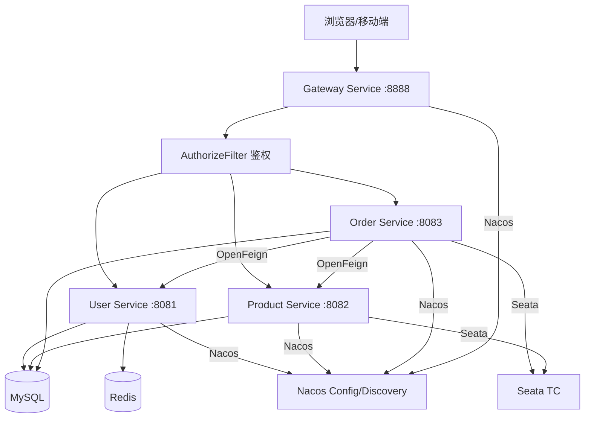

# Inventory Management Microservices

本项目是基于 Spring Cloud Alibaba 重构后的库存管理系统微服务版。

## 1. 架构图



## 2. 核心技术栈
- **核心框架**: Spring Boot 3.3.2, Spring Cloud 2023.0.3
- **注册中心/配置中心**: Nacos 2023.0.1.2
- **服务调用/负载均衡**: OpenFeign, Spring Cloud LoadBalancer
- **容错限流**: Sentinel
- **网关**: Spring Cloud Gateway (自定义 AuthorizeFilter)
- **分布式事务**: Seata (AT 模式)
- **数据库/持久层**: MySQL 8.0, MyBatis
- **缓存**: Redis
- **部署**: Docker, Kubernetes (K8s)
- **工具**: EasyExcel (导出), ZXing (条码)

## 3. 模块说明
- `common-api`: 公共域对象、统一响应结果、工具类（JwtUtils, RedisUtils）、通用拦截器（UserContextInterceptor）。
- `user-service`: 用户认证、资料管理、管理员管理。实现 RBAC 权限控制的基础。
- `product-service`: 商品资料、仓库管理、库存流水、条码识别。
- `order-service`: 销售订单、采购订单。集成 Seata 保证下单与扣减库存的原子性。
- `gateway-service`: 统一入口。负责路由转发、跨域处理、基于 Redis 的全局 Token 鉴权及用户信息下发。


## 2. 部署步骤

### 第一步：启动中间件
进入 `inventory-microservices` 目录，执行：
```bash
docker-compose -f docker-compose-middleware.yml up -d
```
中间件包含：
- MySQL (3306): 自动初始化 `inventory_db` 与 Nacos 库。
- Redis (6379): 用于缓存。
- Nacos (8848): 控制台地址 http://localhost:8848/nacos (用户名密码 nacos/nacos)。
- Sentinel (8858): 控制台。
- Seata (8091): 事务协调者。

### 第二步：配置 Nacos
登录 Nacos 控制台，创建一个 Data ID 为 `common.yaml` 的配置，内容参考项目根目录下的 `nacos-common-config.yaml`。

### 第三步：编译并启动微服务
```bash
./mvnw clean install -DskipTests
# 依次启动各模块的 Application 类
```

## 3. 核心功能验证
- **模拟下单**: POST `http://localhost:8888/api/sale-orders`。
- **服务降级**: 停止 `product-service`，再次下单将触发 Feign Fallback。
- **分布式事务**: 下单失败时，Seata 会根据 `undo_log` 自动回滚已执行的操作。
